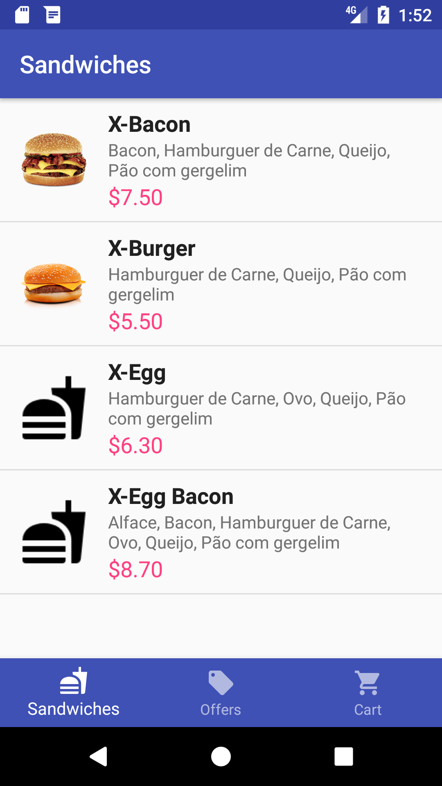
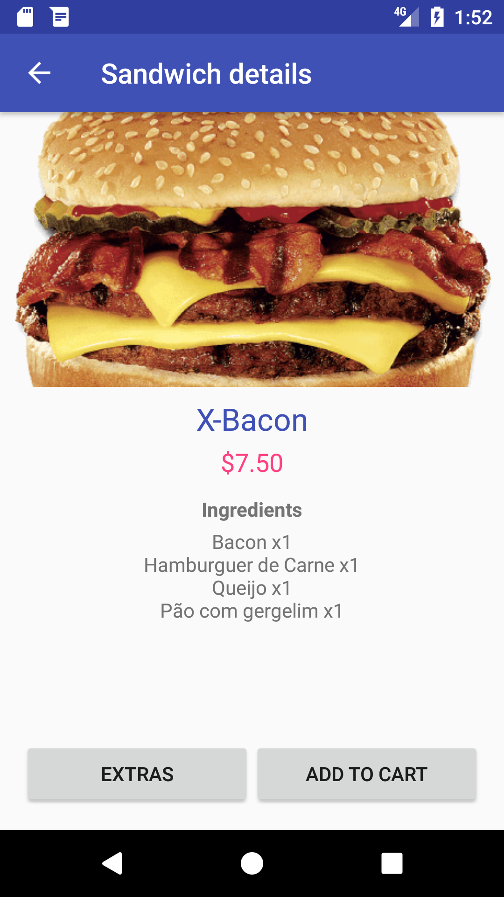
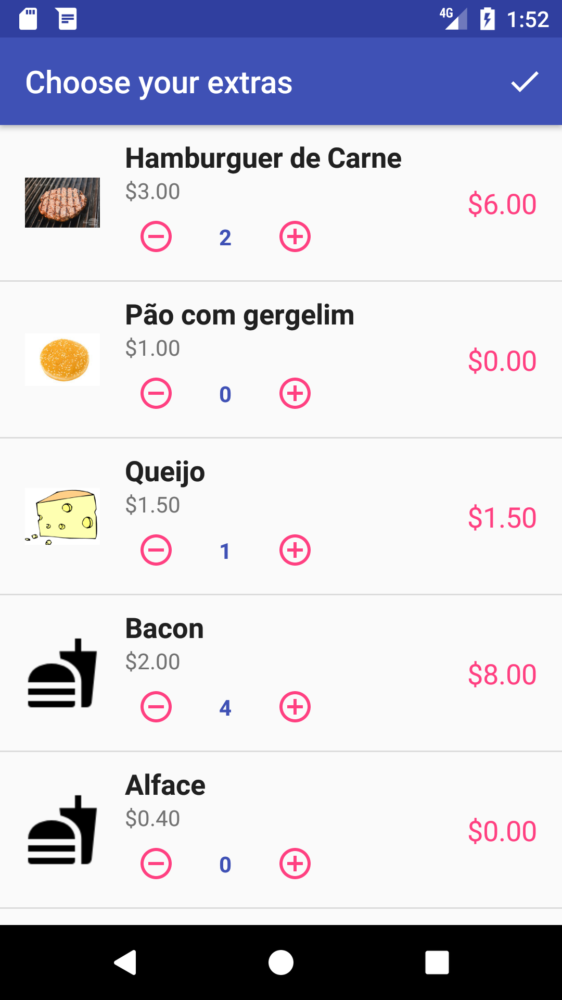
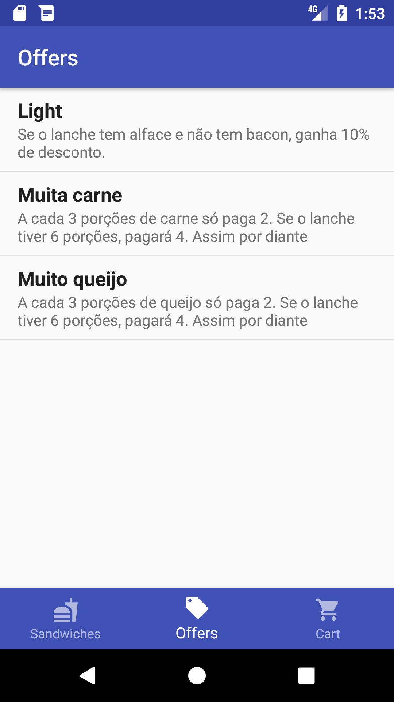
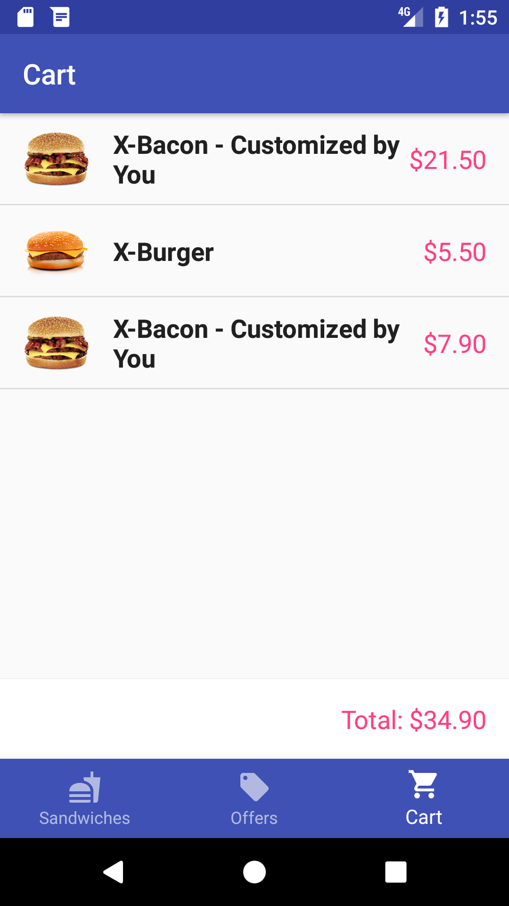

# RestaurantApp

[](https://circleci.com/gh/brunazp/restaurant-app)

## Motivation
This project was created to exercise my Android development knowledge and build new skills around it.

## About the app
The app is a simple restaurant order manager, in which is possible to:
* Choose and customize a sandwich
* Add sandwiches to an order
* Check the order, its items and prices
* Check availale offers 

To download a debug version of the app, click [here](https://drive.google.com/file/d/1uk82CcICj_V6KyJ3OAaDGxVfMPwqkCEy/view?usp=sharing).

## Screenshots
<p align="center">
  
  
  
  
  
</p>

## Characteristics
* Used Trello to plan and execute project. Link [here](https://trello.com/b/IaRFcgyX/restaurant-app)
* Developed using Kotlin
* Tested price calculations using JUnit 
* Implemented using a MVP architecture
* Hosted server at Heroku. The code is available [here](https://github.com/brunazp/restaurant-server). You can also test API calls using this URL: [https://restaurant-app-service.herokuapp.com/api/](https://restaurant-app-service.herokuapp.com/api/)
* Used CircleCI for Continuous Integration since the beginning of the project
* Implemented the project's dependencies injection using Kodein

## Libraries used
* Support Library
* Glide
* Retrofit
* RxJava2
* Kodein

## Future features and Known Issues
You can check a list of future features on [Trello](https://trello.com/b/IaRFcgyX/restaurant-app) at card "App Backlog"
Knows issues available [here](https://trello.com/c/y6Cy9dQm/13-bugs-and-improvements).

## License
```
The MIT License (MIT)

Copyright (c) 2018 Bruna Panaggio

Permission is hereby granted, free of charge, to any person obtaining a copy of this software and associated documentation files (the "Software"), to deal in the Software without restriction, including without limitation the rights to use, copy, modify, merge, publish, distribute, sublicense, and/or sell copies of the Software, and to permit persons to whom the Software is furnished to do so, subject to the following conditions:

The above copyright notice and this permission notice shall be included in all copies or substantial portions of the Software.

THE SOFTWARE IS PROVIDED "AS IS", WITHOUT WARRANTY OF ANY KIND, EXPRESS OR IMPLIED, INCLUDING BUT NOT LIMITED TO THE WARRANTIES OF MERCHANTABILITY, FITNESS FOR A PARTICULAR PURPOSE AND NONINFRINGEMENT. IN NO EVENT SHALL THE AUTHORS OR COPYRIGHT HOLDERS BE LIABLE FOR ANY CLAIM, DAMAGES OR OTHER LIABILITY, WHETHER IN AN ACTION OF CONTRACT, TORT OR OTHERWISE, ARISING FROM, OUT OF OR IN CONNECTION WITH THE SOFTWARE OR THE USE OR OTHER DEALINGS IN THE SOFTWARE.
```